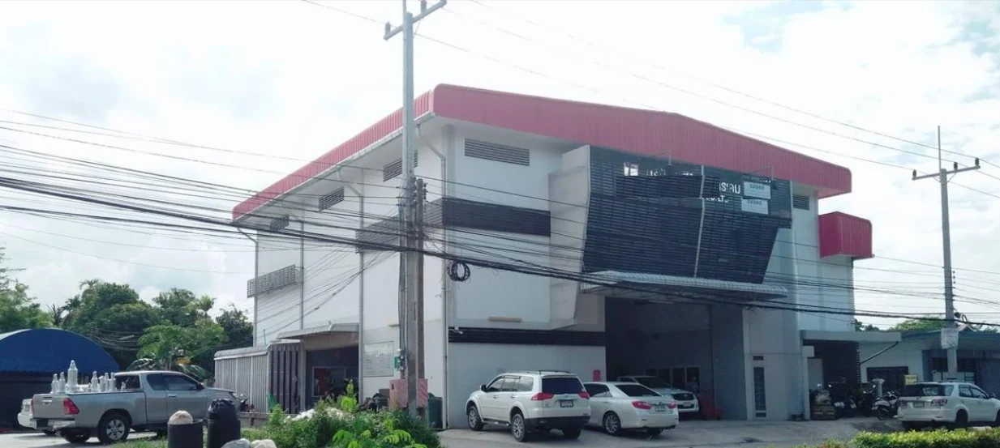

<section class="hero">

 COMPLYMAX CO., LTD.
<h1>ทุกการวัดที่แม่นยำ เริ่มจากความเข้าใจ ในหน้างาน</h1>
เครื่องมือวัดอุตสาหกรรม วาล์ว และอะไหล่ พร้อมบริการ Overhaul Sight Glass จากการเลือกอุปกรณ์ถึงการดูแลหน้างาน

<a class="button button-gold" href="products/">ดูผลิตภัณฑ์ของเรา ↗</a><a class="text-link light" href="services/">รู้จักบริการ →</a>

 INSTRUMENTATION · VALVES · SIGHT GLASS

FIELD SERVICE / SIGHT GLASS
ดูแลอุปกรณ์ ด้วยความเข้าใจระบบจริง
<a href="services/" aria-label="ดูบริการ Overhaul Sight Glass">↗</a>

</section>

01
<strong>Instrumentation</strong><small>Level · Pressure · Temperature · Flow</small>

02
<strong>Valves & Spare Parts</strong><small>วาล์ว อุปกรณ์ป้องกันถัง และอะไหล่</small>

03
<strong>Overhaul & Service</strong><small>Sight Glass · Workshop · Testing</small>

<section class="section">

01 / THE COMPANY
<h2>เข้าใจเครื่องมือ เข้าใจอุตสาหกรรม</h2>

COMPLYMAX ให้บริการด้านเครื่องมือวัด วาล์ว อะไหล่ Sight Glass และ Electrode สำหรับ Boiler รวมถึงอุปกรณ์ป้องกันสำหรับระบบอุตสาหกรรม

รองรับงานในกลุ่มเคมีและปิโตรเคมี โรงไฟฟ้า คลังเก็บถังน้ำมัน น้ำมันและก๊าซ และโครงการ EPC โดยมีทั้งผลิตภัณฑ์และบริการสำหรับงานซ่อมบำรุง
<a class="text-link" href="about/">รู้จัก COMPLYMAX →</a>

</section>

<section class="section section-pale">

02 / PRODUCTS & SOLUTIONS
<h2>อุปกรณ์ที่ตอบโจทย์ระบบของคุณ</h2>
<a class="text-link" href="products/">ผลิตภัณฑ์ทั้งหมด ↗</a>

<a class="product-card" href="products/#pressure">

01 / MEASUREMENT<h3>เครื่องมือวัดความดัน</h3>
Pressure Gauge · Transmitter · Switch
↗
</a>
<a class="product-card" href="products/#level">

02 / LEVEL<h3>เครื่องมือวัดระดับ</h3>
Magnetic · Radar · Ultrasonic
↗
</a>
<a class="product-card" href="products/#boiler">

03 / BOILER<h3>Sight Glass & Boiler</h3>
Level Gauge · Glass · Mica · Gasket
↗
</a>
<a class="product-card" href="products/#valves">

04 / CONTROL<h3>วาล์วและอุปกรณ์ควบคุม</h3>
Control · Manual · Tank Protection
↗
</a>

</section>

<section class="section">

PRESSURE & LEAKAGE TEST

03 / SPECIALIZED SERVICE
<h2>Overhaul Sight Glass ดูแลครบทุกขั้นตอน</h2>
ตั้งแต่ถอดอุปกรณ์ ตรวจสภาพ ทำความสะอาดและเปลี่ยนอะไหล่ ไปจนถึงทดสอบความดัน การรั่ว และติดตั้งกลับ
<ol class="process-list"><li>01
<strong>Remove</strong>
ถอดอุปกรณ์จากหน้างาน

</li><li>02
<strong>Inspect & Restore</strong>
ตรวจสภาพ ทำความสะอาด และเปลี่ยนอะไหล่

</li><li>03
<strong>Test & Re-install</strong>
ทดสอบความดันและการรั่ว พร้อมติดตั้งกลับ

</li></ol><a class="text-link" href="services/">รายละเอียดงานบริการ →</a>

</section>

<section class="section section-dark">

04 / SELECTED REFERENCES
<h2>ผลงานจากหน้างานจริง</h2>
<a class="text-link light" href="projects/">ดูผลงานทั้งหมด ↗</a>

<a class="project-card" href="projects/#klinger-2025">
2025 / NPP11

OVERHAUL / SIGHT GLASS
<h3>KLINGER Sight Glass ↗</h3>
</a>
<a class="project-card" href="projects/#igema-2025">
2025 / NPP6

NEW EQUIPMENT / BOILER LEVEL
<h3>IGEMA Bi-color Gauge ↗</h3>
</a>

</section>

<section class="section">

05 / FACILITY
<h2>พื้นที่พร้อม สำหรับงานซ่อมบำรุง</h2>
Workshop ที่ระยอง พร้อมพื้นที่ปฏิบัติงาน เครน อุปกรณ์ Pressure Hydro Test และ Bench Test สำหรับ Safety Valve
<a class="text-link" href="workshop/">สำรวจ Workshop →</a>

</section>
<section class="industries">

INDUSTRIES WE SERVE

Chemical & PetrochemicalPower PlantTank FarmOil & GasEPC

</section>
