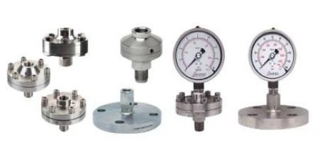
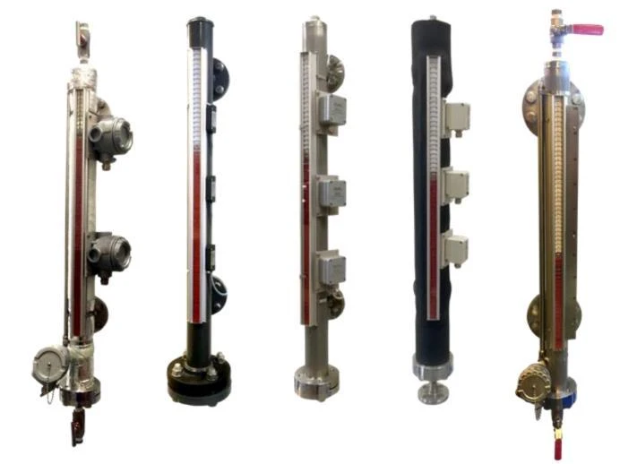
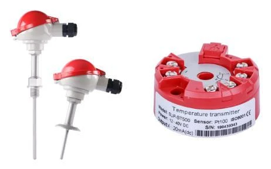
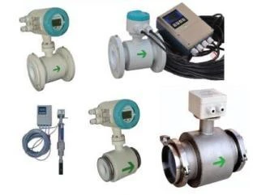
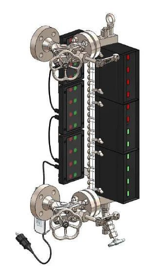
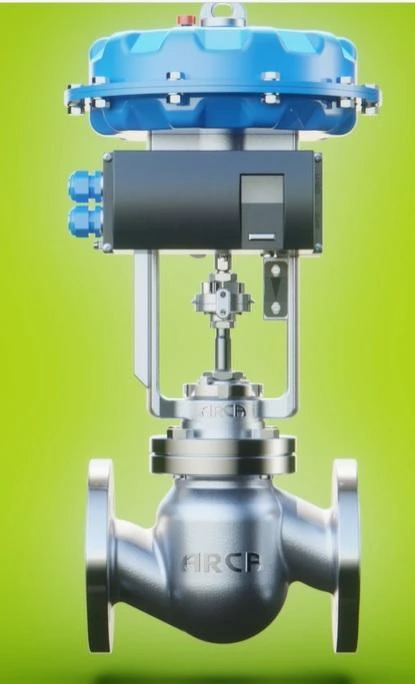
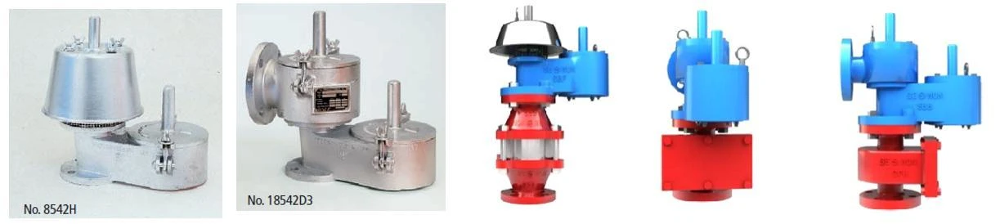

<section class="page-hero">

PRODUCTS & SOLUTIONS
<h1>เลือกอุปกรณ์ ให้ตรงกับการใช้งาน</h1>
เครื่องมือวัด วาล์ว และอะไหล่สำหรับงานอุตสาหกรรม ติดต่อทีมงานเพื่อประเมินรุ่น วัสดุ และเงื่อนไขการใช้งานที่เหมาะสม

</section>
<section class="section section-pale">

<button type="button" data-filter="all" aria-pressed="true">ทั้งหมด</button><button type="button" data-filter="measurement" aria-pressed="false">เครื่องมือวัด</button><button type="button" data-filter="boiler" aria-pressed="false">Boiler & Sight Glass</button><button type="button" data-filter="valves" aria-pressed="false">วาล์วและอุปกรณ์ป้องกัน</button>แสดง 8 หมวดผลิตภัณฑ์

<article class="catalogue-card" id="pressure" data-category="measurement">

01 / PRESSURE<h2>การวัดความดัน</h2><ul><li>Pressure Gauge / Diaphragm Seal</li><li>Industrial Pressure Transmitter</li><li>Flush Diaphragm Transmitter</li><li>Gauge with Contact / Pressure Switch</li></ul><a href="mailto:9dcomplymax@gmail.com?subject=Inquiry%3A%20Pressure%20Instruments">สอบถามอุปกรณ์วัดความดัน ↗</a>
</article>
<article class="catalogue-card" id="level" data-category="measurement">

02 / LEVEL<h2>การวัดระดับ</h2><ul><li>Radar / Ultrasonic Level Meter</li><li>Magnetic Level Gauge</li><li>Electrode Level / Level Switch</li><li>Transparent / Bi-color Level Gauge</li></ul><a href="mailto:9dcomplymax@gmail.com?subject=Inquiry%3A%20Level%20Instruments">สอบถามอุปกรณ์วัดระดับ ↗</a>
</article>
<article class="catalogue-card" id="temperature" data-category="measurement">

03 / TEMPERATURE<h2>การวัดอุณหภูมิ</h2><ul><li>Temperature Gauge</li><li>Temperature Transmitter</li><li>RTD / Thermocouple</li><li>Heater</li></ul><a href="mailto:9dcomplymax@gmail.com?subject=Inquiry%3A%20Temperature%20Instruments">สอบถามอุปกรณ์วัดอุณหภูมิ ↗</a>
</article>
<article class="catalogue-card" id="flow" data-category="measurement">

04 / FLOW<h2>การวัดอัตราการไหล</h2><ul><li>Electromagnetic / Vortex Flowmeter</li><li>Rotameter / Thermal Mass Flowmeter</li><li>Handheld Ultrasonic Flowmeter</li><li>Flow Switch</li></ul><a href="mailto:9dcomplymax@gmail.com?subject=Inquiry%3A%20Flow%20Instruments">สอบถามอุปกรณ์วัดอัตราการไหล ↗</a>
</article>
<article class="catalogue-card" id="boiler" data-category="boiler">

05 / BOILER LEVEL<h2>อุปกรณ์วัดระดับ Boiler</h2><ul><li>Bi-color Water Level Gauge</li><li>Transparent Level Gauge</li><li>Electronic Conductivity Probe</li><li>High-pressure Sight Glass</li></ul><a href="mailto:9dcomplymax@gmail.com?subject=Inquiry%3A%20Boiler%20Level">สอบถามอุปกรณ์สำหรับ Boiler ↗</a>
</article>
<article class="catalogue-card" id="spares" data-category="boiler">

06 / SPARE PARTS<h2>Sight Glass & อะไหล่</h2><ul><li>Reflex / Transparent Gauge Glass</li><li>Mica / Gasket / Glass Assembly</li><li>Color-port Gauge Glass</li><li>อะไหล่ Electrode สำหรับ Boiler</li></ul><a href="mailto:9dcomplymax@gmail.com?subject=Inquiry%3A%20Sight%20Glass%20Spare%20Parts">สอบถามอะไหล่ Sight Glass ↗</a>
</article>
<article class="catalogue-card" id="valves" data-category="valves">

07 / VALVES<h2>วาล์วอุตสาหกรรม</h2><ul><li>Pneumatic Control Valve</li><li>Ball / Globe / Butterfly Valve</li><li>Manual Valve</li><li>Safety Relief Valve</li></ul><a href="mailto:9dcomplymax@gmail.com?subject=Inquiry%3A%20Industrial%20Valves">สอบถามวาล์วอุตสาหกรรม ↗</a>
</article>
<article class="catalogue-card" id="tank-protection" data-category="valves">

08 / TANK PROTECTION<h2>อุปกรณ์ป้องกันถัง</h2><ul><li>Pressure / Vacuum Relief Valve</li><li>N₂ Blanketing Valve / Gauge Hatch</li><li>Emergency Valve / Vent Cover</li><li>Flame Arrester</li></ul><a href="mailto:9dcomplymax@gmail.com?subject=Inquiry%3A%20Tank%20Protection">สอบถามอุปกรณ์ป้องกันถัง ↗</a>
</article>

รุ่น สเปก และวัสดุขึ้นอยู่กับอุปกรณ์และสภาวะการใช้งาน กรุณาส่งข้อมูลอุณหภูมิ ความดัน ของไหล และจุดเชื่อมต่อให้ทีมงานตรวจสอบก่อนเลือกผลิตภัณฑ์

</section>
