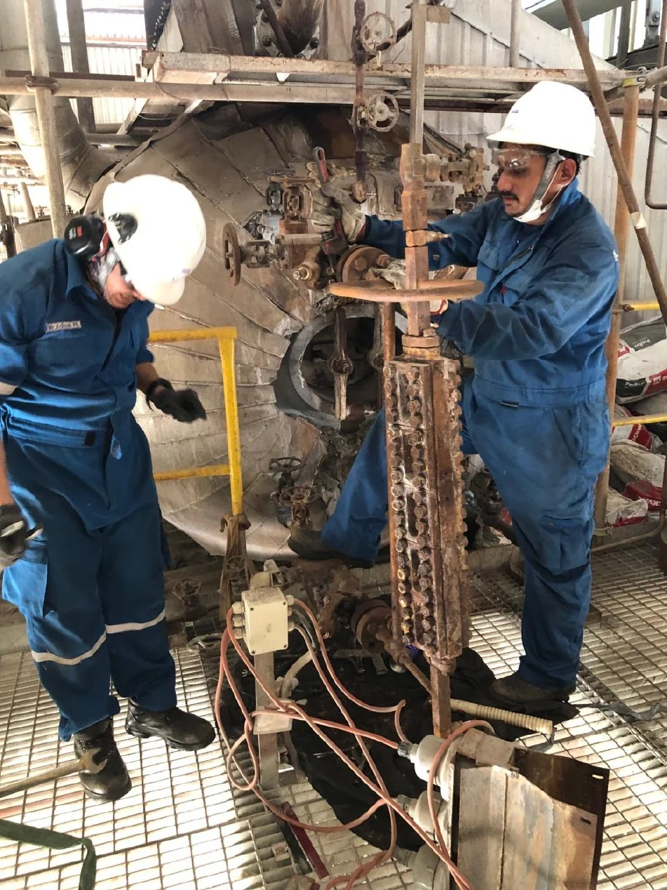
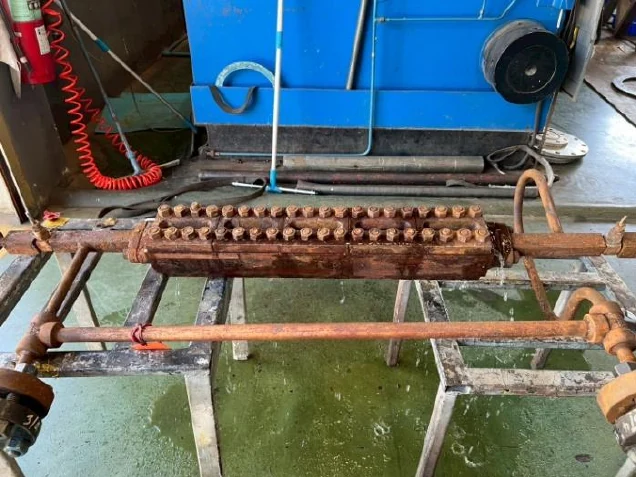
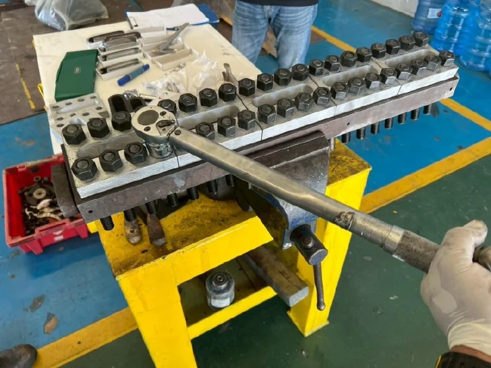
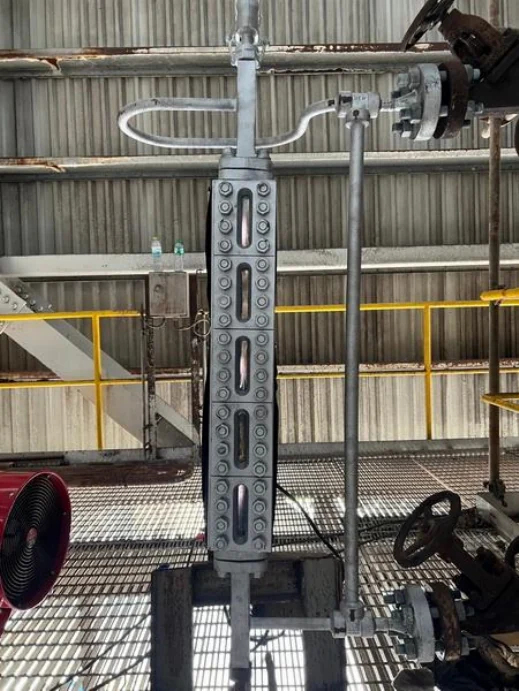
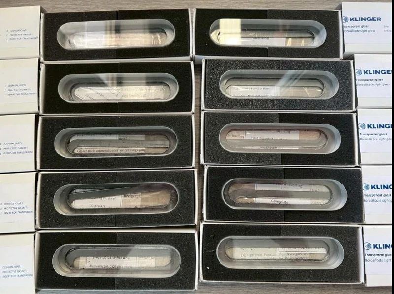

<section class="page-hero">

SPECIALIZED SERVICE
<h1>Overhaul Sight Glass</h1>
ดูแลอุปกรณ์ตั้งแต่ถอดจากหน้างาน ตรวจสภาพและเปลี่ยนอะไหล่ จนถึงทดสอบความดัน การรั่ว และติดตั้งกลับ

</section>
<section class="section">

OUR SERVICE PROCESS
<h2>4 ขั้นตอนของงานบริการ</h2>
<a class="text-link" href="../downloads/">ดาวน์โหลด Service Profile ↗</a>

<article class="step-card">
01
<h3>Remove / ถอดอุปกรณ์</h3>
ถอดชุด Sight Glass จากหน้างาน เพื่อส่งเข้ากระบวนการตรวจสภาพและซ่อมบำรุงตามขอบเขตงานที่ตกลง

</article>
<article class="step-card">
02
<h3>Inspection & Dismantle</h3>
ตรวจสภาพ ถอดแยกชิ้นส่วน ทำความสะอาด และเปลี่ยนอะไหล่ที่เกี่ยวข้องกับงาน Overhaul

</article>
<article class="step-card">
03
<h3>Pressure & Leakage Test</h3>
ตรวจสอบสภาพก่อนซ่อมและทดสอบขั้นสุดท้าย (As-found & Final Test) โดยกำหนดเงื่อนไขการทดสอบตามอุปกรณ์และขอบเขตงาน

</article>
<article class="step-card">
04
<h3>Re-install / ติดตั้งกลับ</h3>
ติดตั้งอุปกรณ์กลับที่หน้างานหลังผ่านกระบวนการซ่อมบำรุงและการทดสอบตามที่กำหนด

</article>

</section>
<section class="section section-pale">

PARTS & WORKSHOP SUPPORT
<h2>อะไหล่และพื้นที่ปฏิบัติงาน สำหรับงานซ่อมบำรุง</h2>
รองรับงานอะไหล่กระจก Mica, Gasket และส่วนประกอบสำหรับ Level Gauge พร้อม Workshop ที่ระยอง และอุปกรณ์สำหรับ Pressure Hydro Test

<a class="text-link" href="../products/#spares">ดูหมวดอะไหล่ →</a><a class="text-link" href="../workshop/">ดู Workshop →</a>

</section>
