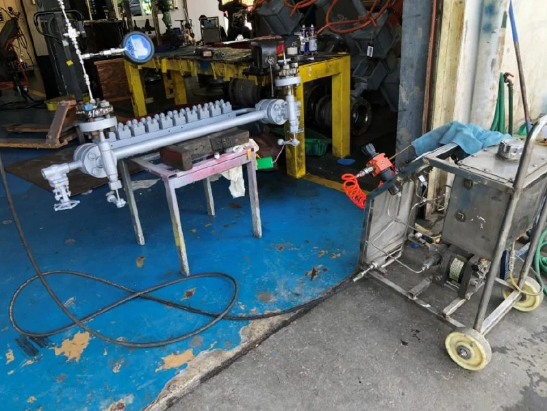
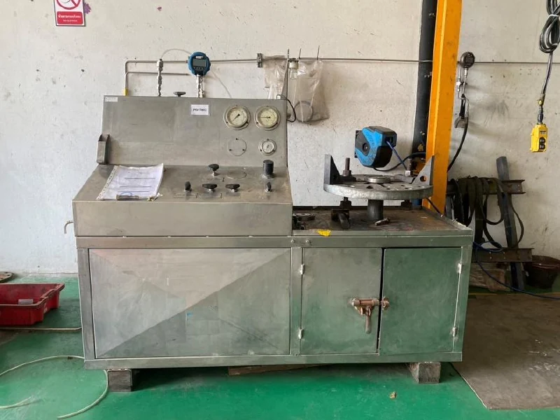

<section class="page-hero">

FACILITY / RAYONG
<h1>Workshop ที่ระยอง</h1>
พื้นที่และอุปกรณ์สำหรับรองรับงานซ่อมบำรุง ตั้งแต่ตรวจสภาพชิ้นส่วนจนถึงการทดสอบอุปกรณ์

</section>
<section class="section">

SERVICE FACILITY
<h2>พื้นที่พร้อมสำหรับ งานบริการอุตสาหกรรม</h2>
Workshop ประกอบด้วยพื้นที่ปฏิบัติงานภายใน เครน อุปกรณ์ Pressure Hydro Test และ Bench Test สำหรับ Safety Valve

ติดต่อทีมงานเพื่อนัดหมายและประเมินขอบเขตงาน รวมถึงข้อกำหนดการทดสอบของอุปกรณ์ก่อนนำส่งเข้ารับบริการ

<a class="button button-dark" href="../contact/">นัดหมายกับทีมงาน ↗</a>

</section>
<section class="section section-pale">

TESTING FACILITIES
<h2>อุปกรณ์ทดสอบและงานบริการ</h2>
<figure><figcaption><strong>Pressure Hydro Test</strong> · อุปกรณ์สำหรับทดสอบความดัน</figcaption></figure><figure><figcaption><strong>Safety Valve Bench Test</strong> · ชุดทดสอบ Safety Valve</figcaption></figure>

</section>
